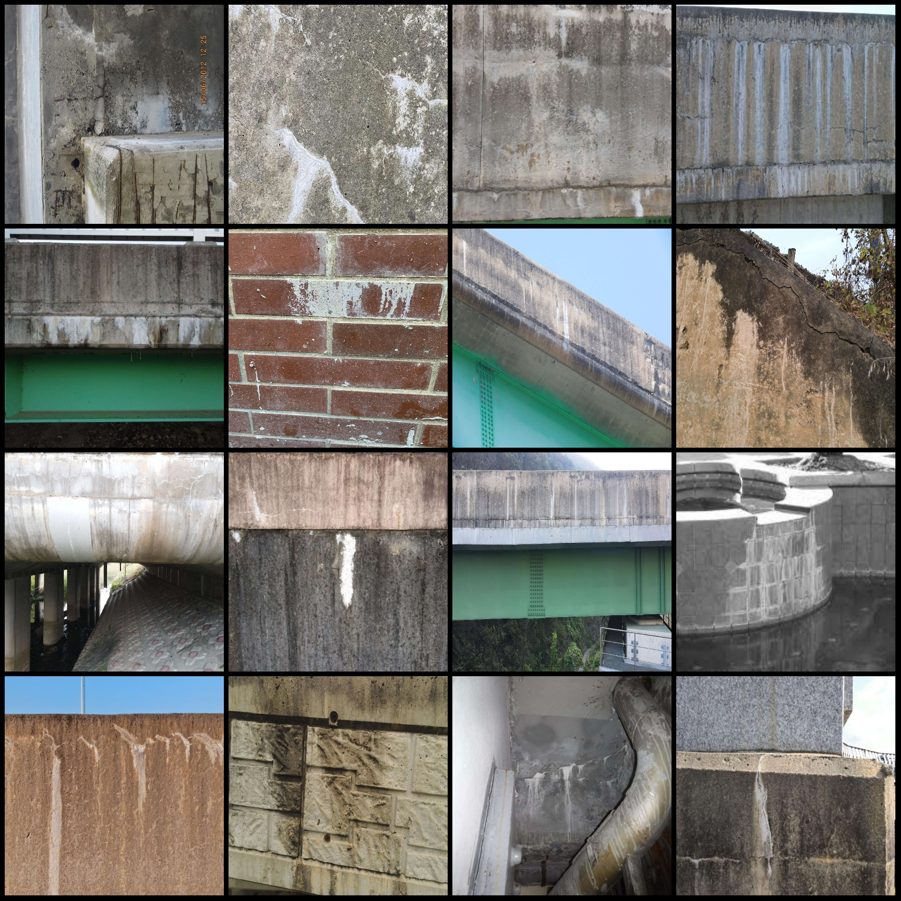
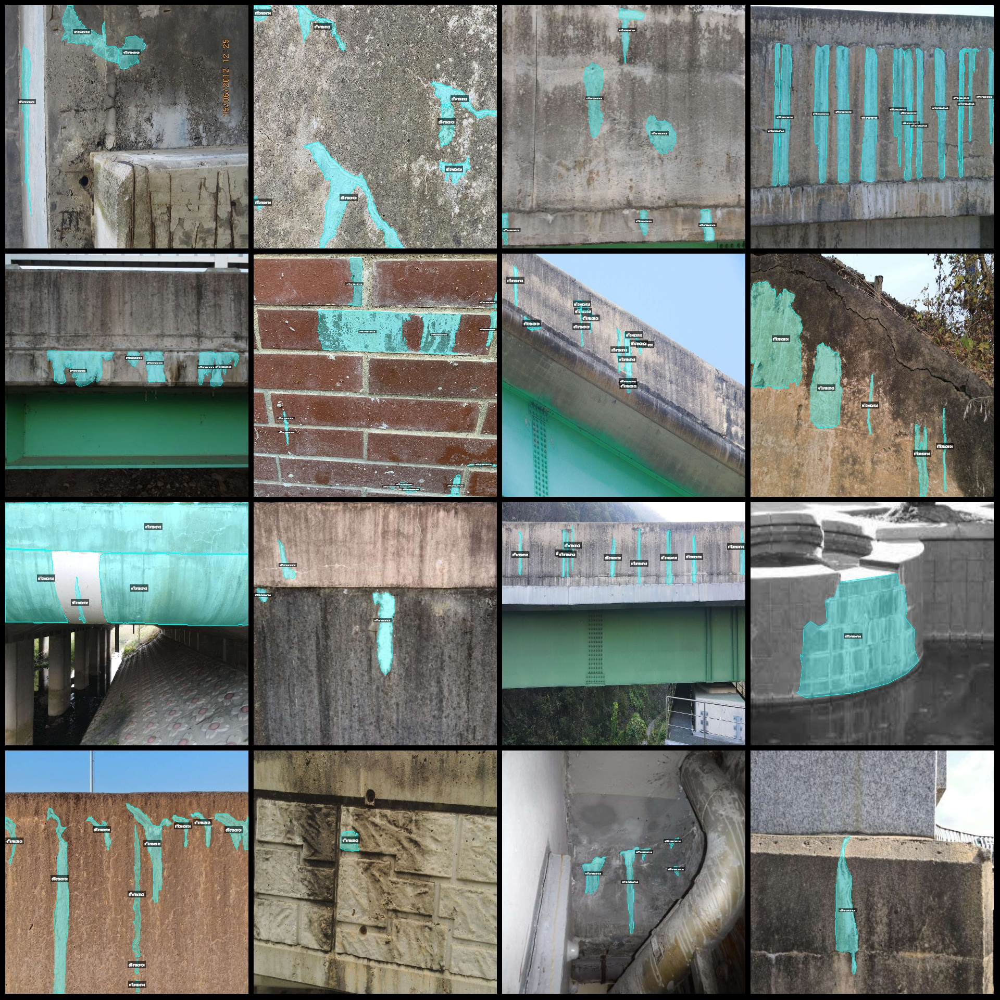
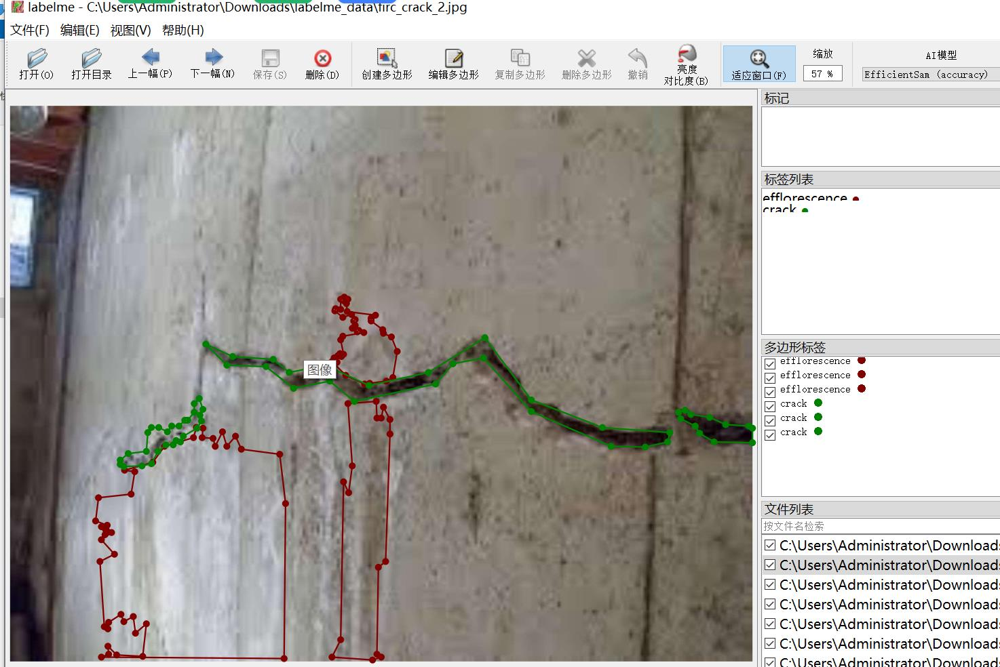

# Bridge Wall Concrete Cracks and Decay Identification Segmentation Dataset in LabelMe format with 7752 images in 2 categories

Dataset format: LabelMe format (excluding mask files, only containing jpg images and corresponding json files)
Number of images (number of jpg files): 7752
Number of annotations (json file count): 7752
Number of annotation categories: 2
Annotation category names: ["efflorescence", "crack"]
Number of boxes per category:  
Efflorescence (decay) count = 53656  
Crack (cracks) count = 5  
Total box count: 53661  
Annotation tool used: labelme=5.5.0  
Image resolutions: Multiple resolutions, such as 1920x1080, 1920x1885, etc.  
Annotation rules: Polygons are drawn around the categories  
Important note: You can open and edit the dataset using LabelMe, but the json dataset needs to be converted into either a mask or Yolo/COCO format for instance segmentation or semantic segmentation  
Special declaration: This dataset does not guarantee the accuracy of the trained models or weight files  
Image previews:  
Annotation examples:  
Randomly selected 16 images for annotation:  
Annotation drawing results:  
LabelMe editing example image:

## Images

Here is a pay link on Stripe ( https://buy.stripe.com/3cs8yP7sY87d0vu9AB ). Please contact me lonlonago@foxmail.com after funding $89, and I will send you a complete data files , thank you!

